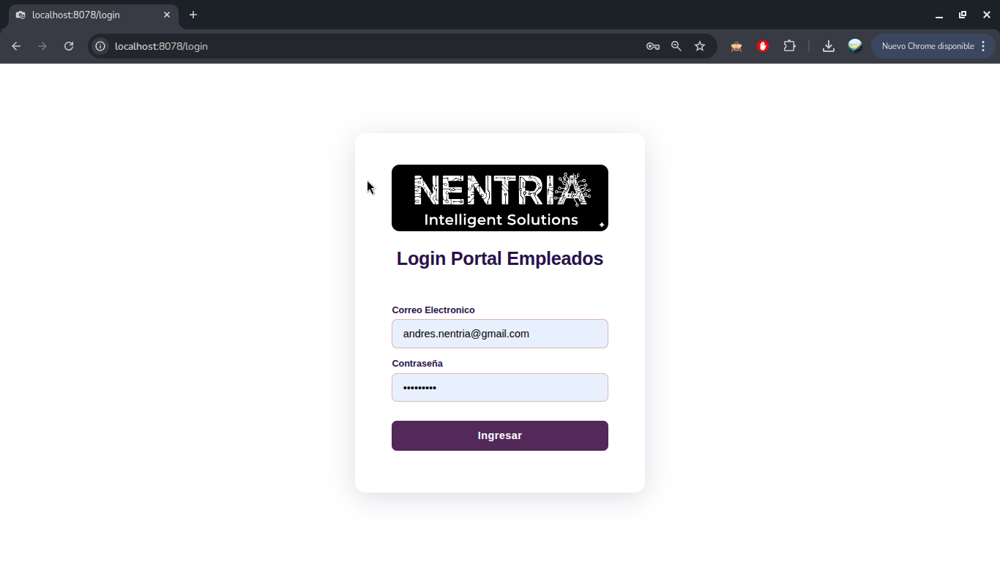
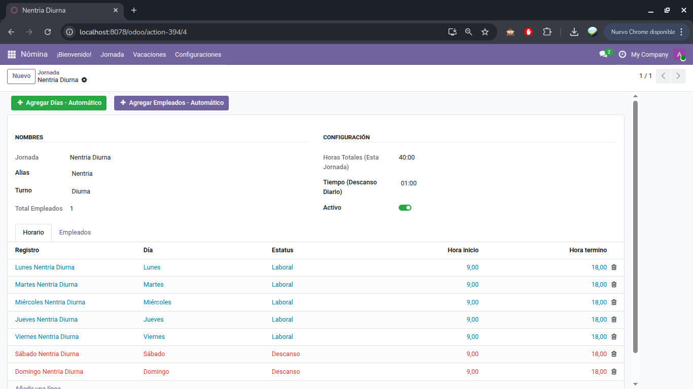

# Nentria Nenova `Nominas` 🗳️



Software modulo `odoo` desarrollado por `Nentria` para contabilidad.

## Modulos



Breve descpripción de los modulos desarrollados en este paquete.

|modulos|Descripción|
|-------|-----------|
|**doc**|Extiende Empleados - Permite Almacenar contratos & Documentación|
|**geo**|Agrega registros de geolocalización para pase de asitencias|
|**net**|Agrega portal web para pase de asitencias & carga de datos sin entrar al `backend` de odoo|
|**nomina**|Agrega el cálculo de nomina para empleados. (Jornadas) (Derechos Vacacionales) (SDI) etc...|

## Configuración e Inicio Rápido

```bash
# Directorios
mkdir data ; mkdir ./data/odoo ; mkdir ./data/odoo_dev ; mkdir ./data/db ; mkdir ./data/db_dev ; mkdir ./config ; mkdir -p ./data/import ; mkdir -p ./data/import_dev

#Permisos
sudo chmod -R 755 ./data/import
sudo chmod -R 755 ./data/import_dev

# Permisos del usuario odoo <- Imagen oficial odoo:19.0
sudo chown -R 100:101 ./data/odoo
sudo chmod -R 750 ./data/odoo

sudo chown -R 100:101 ./data/odoo_dev
sudo chmod -R 750 ./data/odoo_dev

# Permisos del usuario postgres <- Imagen oficial postgres:15
sudo chown -R 999:999 ./data/db
sudo chmod -R 700 ./data/db

sudo chown -R 999:999 ./data/db_dev
sudo chmod -R 700 ./data/db_dev
```

### Puertos

|Puertos|Descripción|
|-------|-----------|
|8077|_Puerto Producción_|
|8078|_Puerto Desarrollo_|

### Ficheros configuración `odoo`

#### Variables Entorno

```env
POSTGRES_DB=odoo
POSTGRES_USER=odoo
POSTGRES_PASSWORD=
```

#### Producción

```txt
[options]
# Importante la ruta donde odoo buscara los custom addons.
# Esta ruta se especifica en el docker-compose.yml
addons_path = /mnt/extra-addons
# Ruta directorio de escritura "var" de odoo. Ver docker-compose.yml
data_dir = /var/lib/odoo
# Base de datos: ver docker-compose.yml
db_host = db_nentria
db_port = 5432
# Para resolver; son las variables de entorno usado por el compose al leer .env
db_user = odoo
db_name = odoo
db_password = 
admin_passwd = 
http_interface = 0.0.0.0
http_port = 8069
proxy_mode = True
```

#### Desarrollo

```txt
[options]
# Importante la ruta donde odoo buscara los custom addons.
# Esta ruta se especifica en el docker-compose.yml
addons_path = /mnt/extra-addons
# Ruta directorio de escritura "var" de odoo. Ver docker-compose.yml
data_dir = /var/lib/odoo
# Base de datos: ver docker-compose.yml
db_host = db_nentria_dev
db_port = 5432
# Para resolver; son las variables de entorno usado por el compose al leer .env
db_user = odoo
db_name = odoo
db_password = 
admin_passwd = 
http_interface = 0.0.0.0
http_port = 8069
proxy_mode = True
```
---